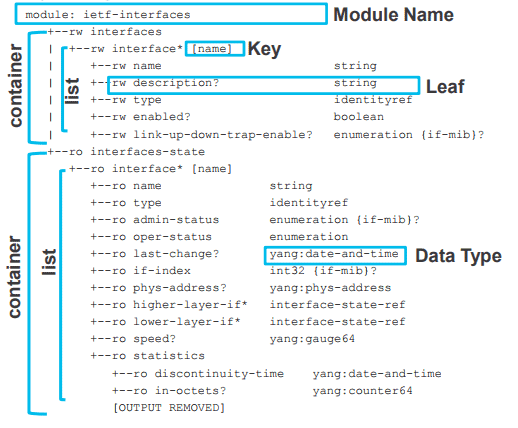
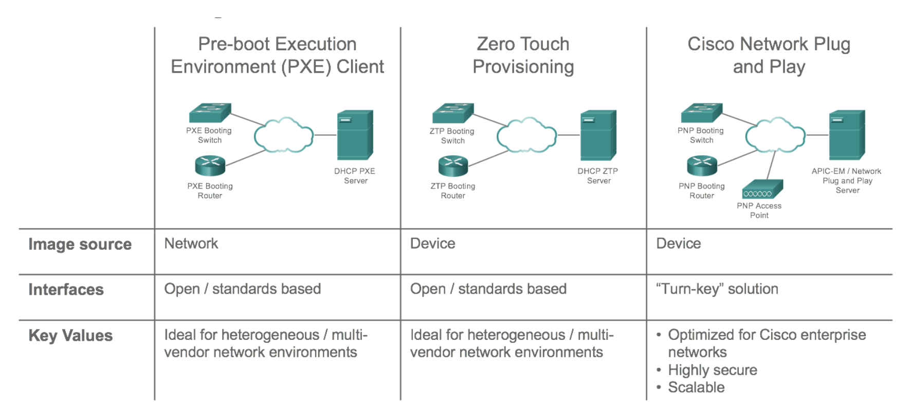

## 1. YANG model Components

A YANG model is made up from various components. Let’s look at these components, in relation to our example (seen within Figure 2).

**Figure 2** – YANG Structure (Source : Cisco Live – DEVNET-1721).

-   **Container** – A collection of information logically grouped. Such a container for configuration, and one for state.
-   **List** – Within a container you can have a list or even multiple lists. Such as a list of interfaces.
-   **Key** – Each item within the list is references via a key.
-   **Leaf** – Inside our list we have leaf’s. Containing our information.
-   **Data Type** – Each leaf is associated against a data type.

## 2. [Day Zero Automation](https://developer.cisco.com/docs/ios-xe/#!day-zero-provisioning-quick-start-guide/preboot-execution-environment-ipxe)

Cisco IOS XE supports three Day Zero technologies: Network Plug-N-Play, Zero Touch Provisioning (ZTP) and Preboot eXectuion Environment (PXE).

